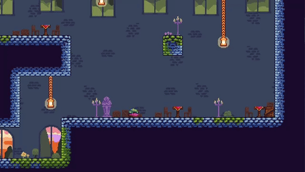
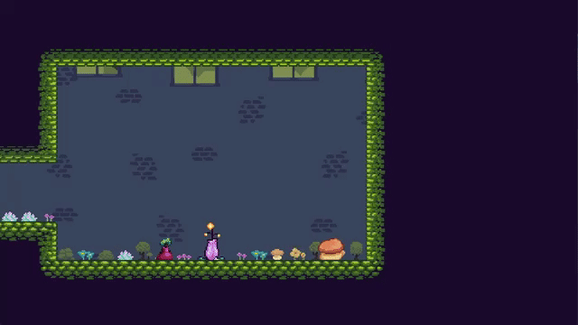
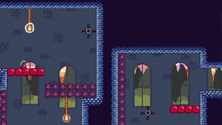

# Locked Away

This is a short, metroidvania platformer that I made with my brother for the **2023 Seattle Game Jam**. I did the game's programming (using the Godot Engine), and my brother made the level designs and pixel art. After finishing the game jam, my brother and I decided we liked the project so much that we spent another month **polishing** and **releasing** it, complete with audio, a longer level, and an end cutscene for when players finish the game.

The movement system and room-by-room layout is inspired by Celeste, but in this game players play a princess with really long hair (think Rapunzel), so they can also use their hair as a grappling hook to get around.

However, at the start of the game, the jealous queen cuts the player's hair off. Players need to collect magic fruit throughout the level in order to grow their hair back. Having longer hair means the player can grapple further, which grants them access to areas they weren't able to reach before.

The game gets pretty hard later on in the level!

